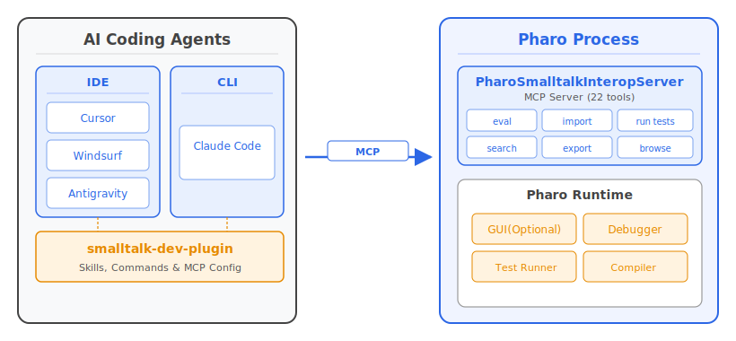
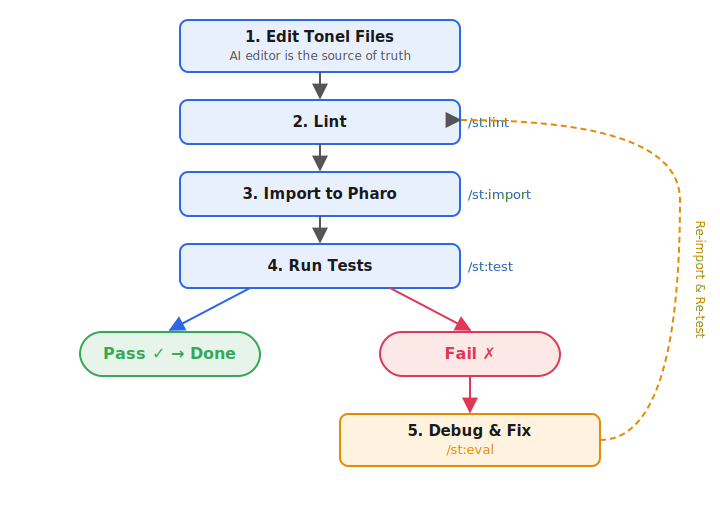

<style>
/* Section divider slides: larger heading */
section.section h2 {
  font-size: 56px;
}
</style>

<!-- _class: title -->
<!-- _paginate: false -->

<style scoped>
section {
  justify-content: center;
  align-items: center;
  gap: 12px;
  text-align: center;
}
section > h1:first-child {
  position: static !important;
  width: auto !important;
  height: auto !important;
  padding-left: 0 !important;
  font-size: 72px;
}
section > h1:first-child::after {
  display: none !important;
}
</style>

# Introducing smalltalk-dev-plugin

### **AI-Driven Development Toolkit for Pharo Smalltalk**
Masashi Umezawa
https://github.com/mumez/smalltalk-dev-plugin

---

<!-- _class: section -->
<!-- _paginate: false -->

<style scoped>
.highlight-box {
  margin-top: 32px;
  background-color: #e8f0fe;
  border-left: 6px solid var(--blue-very-deep);
  padding: 24px 32px;
  border-radius: 0 8px 8px 0;
  font-size: 30px;
}
</style>

## What is smalltalk-dev-plugin?

<div class="highlight-box">
A comprehensive toolkit that bridges <strong>AI code editors</strong> and the <strong>Pharo Smalltalk</strong> environment.
</div>

---

# The AI Agent Problem for Smalltalk

Using AI coding agents with Smalltalk doesn't work well out of the box:

- **No knowledge of Pharo** — AI doesn't know how to interact with the environment
- **Unknown project structure** — Typical Tonel/package layout is unfamiliar
- **No testing/debugging skills** — Can't run tests or diagnose errors
- **No library access** — Can't browse existing classes or methods
- **Poor coding style** — Doesn't know Smalltalk idioms and conventions

This is a major barrier for developers who want AI assistance in Smalltalk.

---

# Enter smalltalk-dev-plugin

We gave AI the complete skillset for Smalltalk development:

| Challenge | Solution |
|-----------|----------|
| Environment interaction | MCP tools for Pharo communication |
| Project structure | `/st:setup-project` with templates |
| Testing & debugging | `/st:test`, `/st:eval`, debugger skill |
| Library navigation | Finder skills, code search tools |
| Code quality | Validator, linter, commenter agent |

**Result**: AI becomes a reliable Smalltalk development partner!

---

# Core Philosophy

## **"AI editor as the source of truth"**
> Edit Tonel files in the AI editor, import to Pharo, test, and iterate.

### At a Glance

- 9 slash commands
- 4 specialized AI skills
- 27+ MCP tools for Pharo interaction
- Automated code quality checks and documentation generation

---

<!-- _class: content-image -->

# Architecture



- Existing AI agents talk to Pharo via MCP — no custom IDE needed
- Even works with headless Pharo — usable in CI and remote agents like Devin

---

# Supported AI Agents

| Agent | Support Level |
|-------|--------------|
| **Claude Code** | Full support (primary) |
| Cursor | Simplified setup via script |
| Windsurf | Simplified setup via script |
| Antigravity | Simplified setup via script |

**The rest of this presentation focuses on the Claude Code version.**

---

<!-- _class: section -->
<!-- _paginate: false -->

## Installation

---

# Installation (1) — Install the Plugin

```bash
# Add marketplace from GitHub
claude plugin marketplace add mumez/smalltalk-dev-plugin

# Install the plugin
claude plugin install smalltalk-dev
```

---

# Installation (2) — Set Up Pharo Side

Install the interop server in Pharo:

```smalltalk
Metacello new
  baseline: 'PharoSmalltalkInteropServer';
  repository: 'github://mumez/PharoSmalltalkInteropServer:master/src';
  load.
```

Start the server:

```smalltalk
SisServer current start.
```

That's it — you're ready to go.

---

# Installation — Other AI Agents

Setup scripts are provided for Cursor, Windsurf, and Antigravity:

```bash
./extra/setup-cursor.sh [target-directory]
./extra/setup-windsurf.sh [target-directory]
./extra/setup-antigravity.sh [target-directory]
```

### Limitations

- Commands use `st-` prefix instead of `st:`
- Some features may differ depending on the agent
- Pharo-side setup is the same as for Claude Code

---

<!-- _class: section -->
<!-- _paginate: false -->

## Basic Usage

---

# Where to Launch Claude

Run `claude` in an **empty directory** or your **project source directory**.

- You can also point to an Iceberg repository directory
- However, to avoid conflicts, it is better to **clone the repo into a separate directory** and use that instead

---

# /st:buddy — Main Entry Point

`/st:buddy` is a friendly assistant that routes to the right tool.

Just describe what you want in natural language:

```
/st:buddy I want to create a Person class with name and age
```

The assistant will:
1. Load the appropriate skill automatically
2. Create the Tonel files
3. Guide you through linting, importing, and testing

---

# /st:buddy — Intelligent Routing

| Your Intent | Loaded Skill |
|-------------|-------------|
| "Create...", "Add..." | smalltalk-developer |
| "Error...", "Test failed..." | smalltalk-debugger |
| "How do I use...?" | smalltalk-usage-finder |
| "Who implements...?" | smalltalk-implementation-finder |

You don't need to remember which tool to use — just talk to `/st:buddy`.

---

<!-- _class: image -->

# Development Workflow



---

<!-- _class: section -->
<!-- _paginate: false -->

## Components

---

# Skills (1) — Developer & Debugger

### smalltalk-developer
The core development skill. Knows Tonel format, package structure, and the full Edit → Lint → Import → Test workflow.

### smalltalk-debugger
Systematic debugging specialist. Diagnoses errors, runs incremental code execution with `/st:eval`, and guides you to the fix.

---

# Skills (2) — Finder Skills

### smalltalk-usage-finder
Discovers how classes and methods are used. Finds examples, analyzes usage patterns, and helps you understand unfamiliar APIs.

### smalltalk-implementation-finder
Finds method implementations across class hierarchies. Useful for learning coding idioms and assessing refactoring impact.

---

# Slash Commands

| Command | Purpose |
|---------|---------|
| `/st:buddy` | Friendly assistant (main entry) |
| `/st:init` | Initialize development session |
| `/st:setup-project` | Create project boilerplate |
| `/st:eval` | Execute Smalltalk expressions |
| `/st:import` | Import Tonel packages to Pharo |
| `/st:export` | Export packages from Pharo |
| `/st:test` | Run SUnit tests |
| `/st:lint` | Check code quality |
| `/st:validate` | Validate Tonel syntax |

---

# Sub-Agent: @smalltalk-commenter

Automatically suggests **CRC-style class comments** for undocumented classes.

- Triggered after file edits via hooks
- Non-intrusive — suggests, doesn't force
- Analyzes complexity and prioritizes classes that need documentation

---

# MCP Servers

Two MCP servers power the integration behind the scenes:

### pharo-interop (22 tools)
Pharo communication — eval, import/export, tests, code navigation, etc.

### smalltalk-validator (5 tools)
Tonel validation and linting.

**Note**: You rarely need to interact with these directly.
`/st:buddy` handles orchestration for you.

---

<!-- _class: section -->
<!-- _paginate: false -->

## Live Examples

---

<style scoped>
pre { font-size: 36px; }
</style>

# Example 1 — Starting from Scratch

A simple use case: starting from an empty directory as a Smalltalk beginner.

```
/st:buddy I'm a Smalltalk beginner. I want to create a Money class
that can perform arithmetic operations across different currency units.
Please help me from the project initialization.
```

---

<!-- _class: column-layout -->

<style scoped>
.column:first-of-type { width: 70%; }
.column:first-of-type img { width: 95%; }
.column:last-of-type { width: 30%; }
</style>

# Example 1 — What Happens Next

<div class="column">

[](https://youtu.be/FsIX0DVkOvg)

</div>
<div class="column">

- [Video](https://youtu.be/FsIX0DVkOvg)
- [Generated source](https://github.com/mumez/smalltalk-dev-plugin-money-example)
- Demo

</div>

---

<style scoped>
pre { font-size: 36px; }
</style>

# Example 2 — Graph Algorithms

A more complex use case for someone familiar with Smalltalk.

```
/st:buddy I want to create GrNode and GrArc to represent directed graphs
and solve shortest path problems. Nodes have a name, arcs have a score.
Let's start this as a GraphGear project.
```

---

<!-- _class: column-layout -->

<style scoped>
.column:first-of-type { width: 70%; }
.column:first-of-type img { width: 95%; }
.column:last-of-type { width: 30%; }
</style>

# Example 2 — What Happens Next

<div class="column">

[](https://youtu.be/MpWw6nuDxcA)

</div>
<div class="column">

- [Video](https://youtu.be/MpWw6nuDxcA)
- [Generated source](https://github.com/mumez/smalltalk-dev-plugin-graph-example)
- Demo

</div>

---

<style scoped>
pre { font-size: 36px; }
</style>

# Example 3 — GUI Programming

Building a GUI application with Spec2.

```
/st:buddy I want to make a simple to-do list using the Spec2 framework.
Include a checkbox for each item, plus an input field 
with Add/Remove buttons at the bottom.
Only checked items can be removed. Start developing.
```

---

<!-- _class: column-layout -->

<style scoped>
.column:first-of-type { width: 70%; }
.column:first-of-type img { width: 95%; }
.column:last-of-type { width: 30%; }
</style>

# Example 3 — What Happens Next

<div class="column">

[](https://youtu.be/9jinoL4bNDs)

</div>
<div class="column">

- [Video](https://youtu.be/9jinoL4bNDs)
- [Generated source](https://github.com/mumez/smalltalk-dev-plugin-gui-example)
- Demo

</div>

---

# Summary

**smalltalk-dev-plugin** makes Pharo Smalltalk development with AI assistants practical and productive.

Just type `/st:buddy` and start building.

---

<!-- _class: all-text-center align-center -->
<!-- _paginate: false -->

# **Feedback and contributions are welcome!**

https://github.com/mumez/smalltalk-dev-plugin
