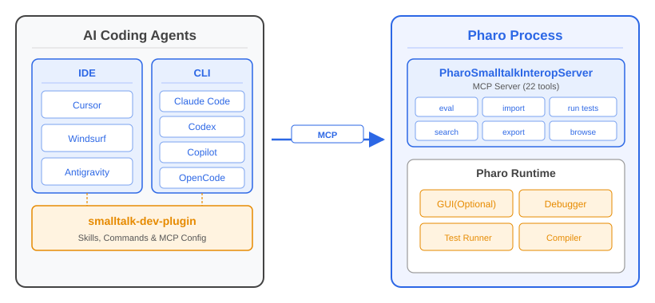
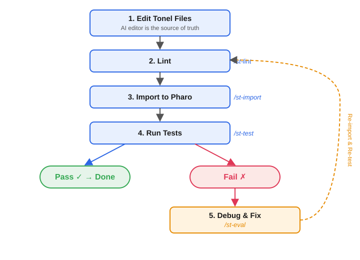

<style>
/* Section divider slides: larger heading */
section.section h2 {
  font-size: 56px;
}
</style>

<!-- _class: title -->
<!-- _paginate: false -->

<style scoped>
section {
  justify-content: center;
  align-items: center;
  gap: 12px;
  text-align: center;
}
section > h1:first-child {
  position: static !important;
  width: auto !important;
  height: auto !important;
  padding-left: 0 !important;
  font-size: 72px;
}
section > h1:first-child::after {
  display: none !important;
}
</style>

# smalltalk-dev-plugin の紹介

### **Pharo Smalltalk 向け AI 駆動開発ツールキット**
梅澤 真史
https://github.com/mumez/smalltalk-dev-plugin

---

<!-- _class: section -->
<!-- _paginate: false -->

<style>
.highlight-box {
  margin-top: 32px;
  background-color: #e8f0fe;
  border-left: 6px solid var(--blue-very-deep);
  padding: 24px 32px;
  border-radius: 0 8px 8px 0;
  font-size: 30px;
}
</style>

## smalltalk-dev-plugin とは？

<div class="highlight-box">
<strong>AI コーディングエージェント</strong>と <strong>Pharo Smalltalk</strong> をつなぐ包括的なツールキットです。
</div>

---

# Smalltalk における AI エージェントの課題

AI コーディングエージェントをそのまま Smalltalk に使ってもうまくいきません：

- **Pharo の知識がない** — AI は環境の操作方法を知らない
- **プロジェクト構造が不明** — Tonelやパッケージ構成を知らない
- **テスト・デバッグができない** — テスト実行やエラー診断の仕方がわからない
- **ライブラリへのアクセスができない** — 既存のクラスやメソッドを参照できない
- **コーディングスタイルが悪い** — Smalltalk のイディオムや慣習を知らない


<div class="highlight-box">
これらは Smalltalk で AI 支援を活用したい開発者にとって大きな障壁でした。
</div>

---

# smalltalk-dev-plugin の登場

AI に Smalltalk 開発の完全なスキルセットを与えました：

| 課題 | 解決策 |
|-----------|----------|
| 環境との対話 | Pharo とやりとりするための MCP ツール群 |
| プロジェクト構造 | プロジェクトテンプレート付き `/st-setup-project` |
| テスト・デバッグ | `/st-test`、`/st-eval`、デバッガースキル |
| ライブラリ参照 | ファインダースキル、コード検索ツール |
| コード品質 | バリデーター、リンター、コメンタースキル |

**結果**: AI が信頼できる Smalltalk 開発パートナーになります！

---

# コアとなる哲学

## **「AIによる編集を唯一の真実の源として扱う」**
> AI が Tonel ファイルを編集し、Pharo にインポートして、テストする という流れを繰り返す。

### 概要

- 9 個のスラッシュコマンド
- 5 種類の専門 AI スキル
- 22 種の Pharo との連携用 MCP ツール 
- 自動コード品質チェックとコメント生成

---

<!-- _class: content-image -->

# アーキテクチャ



- 既存の AI エージェントが MCP 経由で Pharo と通信 — カスタム IDE 不要
- ヘッドレス Pharo にも対応 — CI やリモートエージェント(Devin など)でも利用可能

---

# 対応 AI エージェント

| エージェント | サポートレベル |
|-------|--------------|
| **Claude Code** | フルサポート（メイン） |
| Cursor | スクリプトによる簡易セットアップ |
| Windsurf | スクリプトによる簡易セットアップ |
| Antigravity | スクリプトによる簡易セットアップ |
| GitHub Copilot CLI | スクリプトによる簡易セットアップ |
| OpenCode | スクリプトによる簡易セットアップ |
| Codex CLI | スクリプトによる簡易セットアップ |

**本プレゼンテーションでは Claude Code での利用を中心に紹介します。**

---

<!-- _class: section -->
<!-- _paginate: false -->

## インストール

---

# インストール (1) — プラグインのインストール

```bash
# GitHub からマーケットプレイスを追加
claude plugin marketplace add mumez/smalltalk-dev-plugin

# プラグインをインストール
claude plugin install smalltalk-dev
```

---

# インストール (2) — Pharo 側のセットアップ

### オプションA: Docker（簡単）

[smalltalk-interop-docker](https://github.com/mumez/smalltalk-interop-docker) を使って設定済み Pharo イメージを起動：

```bash
docker compose up -d
```

### オプションB: ローカルでPharoを準備

PharoSmalltalkInteropServerを手動でインストールして起動：

```smalltalk
Metacello new
  baseline: 'PharoSmalltalkInteropServer';
  repository: 'github://mumez/PharoSmalltalkInteropServer:main/src';
  load.

SisServer current start.
```

---

# インストール — その他の AI エージェント

各エージェント向けのセットアップスクリプトが用意されています：

```bash
./extra/setup-cursor.sh [target-directory]
./extra/setup-windsurf.sh [target-directory]
./extra/setup-antigravity.sh [target-directory]
./extra/setup-copilot.sh [target-directory]   # GitHub Copilot CLI
./extra/setup-opencode.sh [target-directory]  # OpenCode
./extra/setup-codex.sh [target-directory]     # Codex CLI
```

### 制限事項

- エージェントによって機能が異なる場合があります
- Pharo 側のセットアップは Claude Code と同じです

---

<!-- _class: section -->
<!-- _paginate: false -->

## 基本的な使い方

---

# Claude の起動場所

**空のディレクトリ**または既存プロジェクトのディレクトリで `claude` を実行します。

- Iceberg リポジトリのディレクトリを指定することもできます
- ただし競合を避けるため、**リポジトリを別のディレクトリにクローン**してそちらを使うことを推奨します

---

# /st-buddy — メインとなるエントリーポイント

`/st-buddy` は適切なツールに誘導してくれる親しみやすいアシスタントです。

やりたいことを言葉で説明するだけです：

```
/st-buddy nameとageを持つPersonクラスを作成したい
```

アシスタントが自動的に以下を行います：
1. 適切なスキルの読み込み
2. Tonel ファイルの作成
3. リント、インポート、テストの支援

---

# /st-buddy — インテリジェントなルーティング

| 意図 | 読み込まれるスキル |
|-------------|-------------|
| 「作成したい」「追加したい」 | smalltalk-developer |
| 「エラーが出た」「テストが失敗した」 | smalltalk-debugger |
| 「使い方は？」 | smalltalk-usage-finder |
| 「誰が実装している？」 | smalltalk-implementation-finder |

どのツールを使えばよいか覚える必要はありません — `/st-buddy` に話しかけるだけです。

---

<!-- _class: image -->

# 開発ワークフロー



---

<!-- _class: section -->
<!-- _paginate: false -->

## コンポーネント

---

# スキル (1) — 開発者 & デバッガー

### smalltalk-developer
コアとなる開発スキル。Tonel フォーマット、パッケージ構造、「編集 → リント → インポート → テスト」のワークフロー全体を把握しています。

### smalltalk-debugger
体系的なデバッグの専門家。エラーを診断し、`/st-eval` を使って段階的にコードを実行し、修正方法をガイドします。

---

# スキル (2) — コードファインダー

### smalltalk-usage-finder
クラスやメソッドの使われ方を調査します。使用例を見つけ、利用パターンを分析し、未知の API の理解を助けます。

### smalltalk-implementation-finder
クラス階層を横断してメソッドの実装を検索します。コーディングイディオムの学習やリファクタリングの影響評価に役立ちます。

---

# スキル (3) — ドキュメント

### smalltalk-commenter
ドキュメント不足のクラスに対して **CRC スタイルのクラスコメント**を自動提案します。フック経由でファイル編集後にトリガーされます。 機械的にではなく、ドキュメントが最も必要なクラスを優先します。

---

# スラッシュコマンド

| コマンド | 目的 |
|---------|---------|
| `/st-buddy` | フレンドリーアシスタント（メインエントリー） |
| `/st-init` | 開発セッションの初期化 |
| `/st-setup-project` | プロジェクトボイラープレートの作成 |
| `/st-eval` | Smalltalk 式の実行 |
| `/st-import` | Tonel パッケージを Pharo にインポート |
| `/st-export` | Pharo からパッケージをエクスポート |
| `/st-test` | SUnit テストの実行 |
| `/st-lint` | コード品質チェック |
| `/st-validate` | Tonel 構文の検証 |


---

# MCP サーバー

2 つの MCP サーバーが連携の裏側を支えています：

### pharo-interop (22 ツール)
Pharo との通信 — eval、インポート/エクスポート、テスト、コードナビゲーション など。

### smalltalk-validator (5 ツール)
Tonel の検証とリント。

**注意**: これらを直接操作する必要はほとんどありません。
オーケストレーションは `/st-buddy` が担当します。

---

<!-- _class: section -->
<!-- _paginate: false -->

## ライブデモ

---

# 例 1 — ゼロからのスタート

空のディレクトリから Smalltalk 初心者として始めるシンプルなユースケース。

```
/st-buddy 私はSmalltalkの初心者です。
異なる通貨単位間で算術演算を行えるMoneyクラスを作成したいです。
プロジェクトの初期設定から手助けして。
```

---

<!-- _class: column-layout -->

<style scoped>
.column:first-of-type { width: 70%; }
.column:first-of-type img { width: 95%; }
.column:last-of-type { width: 30%; }
</style>

# 例 1 — 実行結果

<div class="column">

[](https://youtu.be/FsIX0DVkOvg)

</div>
<div class="column">

- [動画](https://youtu.be/FsIX0DVkOvg)
- [生成されたソース](https://github.com/mumez/smalltalk-dev-plugin-money-example)
- デモ

</div>

---

# 例 2 — グラフアルゴリズム

Smalltalk に慣れたユーザー向けのより複雑なユースケース。

```
/st-buddy 有向グラフを表現するためにGrNodeとGrArcを作成し、
最短経路問題を解きたいと考えています。
ノードにはnameが、アークにはscoreがあります。
GraphGearプロジェクトとして始めましょう。
```

---

<!-- _class: column-layout -->

<style scoped>
.column:first-of-type { width: 70%; }
.column:first-of-type img { width: 95%; }
.column:last-of-type { width: 30%; }
</style>

# 例 2 — 実行結果

<div class="column">

[](https://youtu.be/MpWw6nuDxcA)

</div>
<div class="column">

- [動画](https://youtu.be/MpWw6nuDxcA)
- [生成されたソース](https://github.com/mumez/smalltalk-dev-plugin-graph-example)
- デモ

</div>

---

<style scoped>
pre { font-size: 36px; }
</style>

# 例 3 — GUI プログラミング

Spec2 を使った GUI アプリケーションの構築。

```
/st-buddy Spec2フレームワークを使って、シンプルなToDoリストを作成したい。
各項目にチェックボックスと入力フィールドを配置し、
下部に「追加」と「削除」のボタンを配置する。
削除できるのは、チェックされている項目のみとする。着手して。
```

---

<!-- _class: column-layout -->

<style scoped>
.column:first-of-type { width: 70%; }
.column:first-of-type img { width: 95%; }
.column:last-of-type { width: 30%; }
</style>

# 例 3 — 実行結果

<div class="column">

[](https://youtu.be/9jinoL4bNDs)

</div>
<div class="column">

- [動画](https://youtu.be/9jinoL4bNDs)
- [生成されたソース](https://github.com/mumez/smalltalk-dev-plugin-gui-example)
- デモ

</div>

---

<!-- _class: section -->
<!-- _paginate: false -->

## ケーススタディ

---

<!-- _class: section -->
<!-- _paginate: false -->

# ケーススタディ — 実際のプロジェクト

smalltalk-dev-plugin を使って作成された実際のプロジェクトを紹介します。

<div class="highlight-box">
どちらも <strong>90% 以上が Claude Code + smalltalk-dev-plugin で作成</strong>されました。
</div>

---

# pharo-acp

ACP プロトコルで Pharo 側から AI エージェントに接続するためのライブラリ。

**接続先**: Gemini CLI、Claude Code、OpenCode、Copilot CLI, Codex CLI など

https://github.com/mumez/pharo-acp

---

# pharo-acp-chat-ui

Pharo 向けシンプルな AI Chat GUI。内部で pharo-acp を使用。

https://github.com/mumez/pharo-acp-chat-ui


---

# まとめ

**smalltalk-dev-plugin** は AI アシスタントによる Pharo Smalltalk 開発を実用的かつ生産的にします。

`/st-buddy` と入力して、開発を始めましょう。

---

<!-- _class: all-text-center align-center -->
<!-- _paginate: false -->

# **フィードバックとコントリビューションをお待ちしています！**

https://github.com/mumez/smalltalk-dev-plugin
